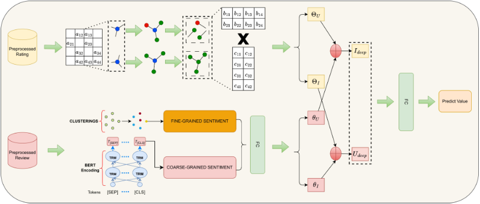

# PreBERT

## Sumary
In summary, the contributions of this work are threefold: 
- (1) We propose comprehensive data pre-processing methods, which involve detecting and reassessing inconsistent data points, which can significantly improve the performance of any RS model. 
- (2) We study replacing the LDA model with a new topic segmentation approach incorporating BERT, followed by clustering methods. To the best of our knowledge, this is the first work to investigate replacing LDA with another topic extraction method in an RS model. 
- (3) Extensive experiments on Amazon datasets showing up to 27.63% improvement over the best previous baseline in rating prediction performance

## Instructions to Run the Source Code

In this study, we use Stanford CoreNLP. Please make sure the device has the required model installed and that `JAVA_HOME` is set up properly on the device.

After that, run the `requirements.txt` file to install the necessary dependencies. Finally, execute the `evaluation.py` file to evaluate the model. The source code includes the extracted review text feature from the <b>All Beauty Amazon</b> dataset.
